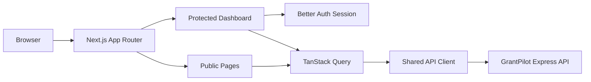

<div align="center">

# GrantPilot AI

### An AI-powered funding discovery and application management platform for finding opportunities, checking eligibility, and tracking applications.

[](https://nextjs.org/)
[](https://react.dev/)
[](https://tailwindcss.com/)
[](https://tanstack.com/query/latest)
[](https://www.better-auth.com/)
[](https://recharts.org/)

[Live Website](https://grantpilot-client-six.vercel.app) · [Server API](https://grantpilot-server.onrender.com) · 

</div>


---

## Table of Contents

- [Overview](#overview)
- [Project Links](#project-links)
- [Demo Credentials](#demo-credentials)
- [User Roles](#user-roles)
- [Core Features](#core-features)
- [Technology Stack](#technology-stack)
- [Frontend Architecture](#frontend-architecture)
- [Application Routes](#application-routes)
- [Screenshots](#screenshots)
- [Getting Started](#getting-started)
- [Environment Variables](#environment-variables)
- [Available Scripts](#available-scripts)
- [Testing](#testing)
- [Deployment](#deployment)
- [Related Repository](#related-repository)
- [Author](#author)

---

## Overview

**GrantPilot AI** is a full-stack funding discovery and application management platform. Users can explore verified scholarships, fellowships, competitions, grants, and research opportunities using search, filters, sorting, and pagination.

Authenticated users can create an applicant profile, save opportunities, start and track applications, upload documents, view personalized recommendations, use the AI assistant, and submit funding opportunities.

Administrators can access protected moderation and management features.

This repository contains the **Next.js frontend** of GrantPilot AI. The application is responsive across mobile, tablet, laptop, and desktop devices and uses protected dashboard routes.

---

## Project Links

| Resource | URL |
|---|---|
| Live Website | `https://grantpilot-client-six.vercel.app` |
| Live API | `https://grantpilot-server.onrender.com` |
| Client Repository | `https://github.com/manjur-moon/grantpilot-client.git` |
| Server Repository | `https://github.com/manjur-moon/grantpilot-server.git` |

---

## Demo Credentials

| Role | Email | Password |
|---|---|---|
| Admin | `moon.rzs09@gmail.com` | `GrantPilot@123` |
| Applicant | `applicant@grantpilot.demo` | `Applicant12345` |

> Demo credentials are intended only for project review. Replace or disable them before using the application with real users.

---

## User Roles

### Guest

- Explores published funding opportunities
- Searches, filters, sorts, and paginates listings
- Views public opportunity details
- Registers or logs in

### Applicant

- Creates and updates an applicant profile
- Saves and removes opportunities
- Starts and tracks applications
- Uploads and manages documents
- Receives personalized recommendations
- Uses the AI assistant
- Submits and manages funding opportunities

### Admin

- Accesses the protected admin workspace
- Reviews users and opportunity submissions
- Manages moderation workflows

---

## Core Features

1. Email/password authentication with Better Auth
2. Google OAuth login support
3. Protected dashboard routes with login redirection
4. User and admin role-aware navigation
5. Responsive public and dashboard layouts
6. Opportunity search, filters, sorting, and pagination
7. Public opportunity details pages
8. Opportunity cards with image, description, metadata, and details button
9. Loading skeletons, empty states, and API error feedback
10. TanStack Query fetching, caching, mutations, and invalidation
11. Save and unsave opportunity functionality
12. Applicant profile management
13. Application tracking and status management
14. Recharts application-status analytics
15. Document upload, analysis, download, and deletion
16. Personalized opportunity recommendations
17. AI-powered application assistant
18. Opportunity submission with image uploads
19. Protected opportunity management page
20. View, edit, and delete actions for submitted opportunities

---

## Technology Stack

### Core

| Technology | Purpose |
|---|---|
| Next.js App Router | Routing, layouts, and production frontend build |
| React | Component-based user interface |
| JavaScript | Application logic |
| Tailwind CSS | Responsive styling |

### State, Data, and Authentication

| Technology | Purpose |
|---|---|
| TanStack Query | Data fetching, caching, mutations, and invalidation |
| Fetch API | API communication |
| Better Auth Client | Authentication and session management |

### UI and Visualization

| Technology | Purpose |
|---|---|
| Recharts | Dashboard analytics charts |
| Lucide React | Interface icons |
| Cloudinary | Opportunity image storage |

---

## Frontend Architecture



Typical source structure:

```text
src/
├── app/
│   ├── (public)/          # Public and authentication pages
│   ├── (dashboard)/       # Protected dashboard pages
│   ├── layout.jsx         # Root layout
│   └── globals.css        # Global styles
├── components/            # Shared cards, navigation, footer, and layouts
├── constants/             # Opportunity filter options
├── hooks/                 # Authentication hooks
├── lib/                   # API client, auth client, formatters, query keys
└── services/              # Opportunity, application, document, and saved-item APIs
```

---

## Application Routes

### Public Routes

| Route | Description |
|---|---|
| `/` | Homepage |
| `/opportunities` | Explore published opportunities |
| `/opportunities/[slug]` | Opportunity details |
| `/login` | User login |
| `/register` | User registration |
| `/forgot-password` | Password recovery |

### Applicant Dashboard

| Route | Description |
|---|---|
| `/dashboard` | Overview and application analytics |
| `/profile` | Applicant profile |
| `/saved` | Saved opportunities |
| `/applications` | Application tracker |
| `/applications/[id]` | Individual application workspace |
| `/documents` | Document management |
| `/recommendations` | Personalized recommendations |
| `/assistant` | AI assistant |
| `/billing` | Billing workspace |
| `/items/add` | Submit an opportunity |
| `/items/manage` | Manage submitted opportunities |
| `/items/edit/[id]` | Edit an opportunity |

### Admin Dashboard

| Route | Description |
|---|---|
| `/admin` | Admin management workspace |

---

## Screenshots

Create a `docs/screenshots` folder and add real screenshots using the filenames below.

<!--
### Home Page


### Explore Opportunities


### Opportunity Details


### Applicant Dashboard


### Manage Opportunities


### Admin Dashboard


### Mobile View

-->

Recommended screenshot size: `1440 × 900` for desktop and `390 × 844` for mobile.

---

## Getting Started

### Prerequisites

- Node.js 20 or newer
- npm
- Running GrantPilot server

### 1. Clone the repository

```bash
git clone https://github.com/YOUR_GITHUB_USERNAME/YOUR_CLIENT_REPOSITORY.git
cd YOUR_CLIENT_REPOSITORY
```

### 2. Install dependencies

```bash
npm install
```

### 3. Create the environment file

macOS/Linux:

```bash
cp .env.example .env.local
```

Windows PowerShell:

```powershell
Copy-Item .env.example .env.local
```

### 4. Configure the environment variables

Update `.env.local` with the local or deployed application URLs.

### 5. Start the development server

```bash
npm run dev
```

Open:

```text
http://localhost:3000
```

---

## Environment Variables

Create `.env.local` from `.env.example`:

```env
API_SERVER_URL=http://localhost:5000
NEXT_PUBLIC_APP_URL=http://localhost:3000
NEXT_PUBLIC_MAX_IMAGE_SIZE_MB=5
```

| Variable | Description |
|---|---|
| `API_SERVER_URL` | GrantPilot backend origin |
| `NEXT_PUBLIC_APP_URL` | GrantPilot frontend origin |
| `NEXT_PUBLIC_MAX_IMAGE_SIZE_MB` | Maximum image upload size |

> Never place MongoDB credentials, Better Auth secrets, Cloudinary secrets, Google secrets, AI keys, or Stripe secret keys in the frontend environment.

---

## Available Scripts

| Command | Description |
|---|---|
| `npm run dev` | Start the Next.js development server |
| `npm run build` | Create the production build |
| `npm start` | Start the production Next.js server |

---

## Testing

Run the production build check:

```bash
npm run build
```

Manual checks:

- Register and log in
- Open protected dashboard routes
- Search, filter, sort, and paginate opportunities
- Save and remove an opportunity
- Start and track an application
- Verify dashboard analytics
- Upload and manage documents
- Submit and manage an opportunity
- Test mobile and desktop layouts

---

## Deployment

### Vercel

1. Push the client repository to GitHub.
2. Import the repository into Vercel.
3. Keep **Next.js** as the framework preset.
4. Add the required environment variables.
5. Deploy the application.

Production environment:

```env
API_SERVER_URL=https://grantpilot-server.onrender.com
NEXT_PUBLIC_APP_URL=https://grantpilot-client-six.vercel.app
NEXT_PUBLIC_MAX_IMAGE_SIZE_MB=5
```

After deployment, add the exact Vercel origin to the backend CORS configuration.

---

## Related Repository

The backend source, API routes, MongoDB models, authentication, AI integration, image uploads, payments, and deployment configuration are maintained in the separate server repository.

**Server Repository:** `https://github.com/YOUR_GITHUB_USERNAME/YOUR_SERVER_REPOSITORY`

---

## Author

**Manjurul Islam Moon**

- GitHub: `https://github.com/manjur-moon`
- LinkedIn: `https://www.linkedin.com/in/md-manjurul-islam-616701295/`
- Email: `mmanjurulislam@gmail.com`

---

## License

No open-source license has been specified.
